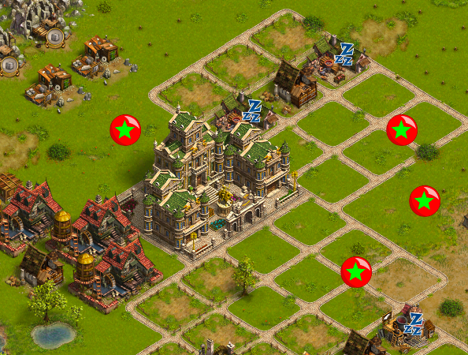

# tsohld
highlight collections on the map the settlers online in linux/macos

------------ play via tsohld ------------
1) in browser in dashboard of plugin [tampermonkey, greasemonkey, violentmonkey] add and enable script.js or tsohld.user.js

2) run in terminal (replace full path):
cd [path]/tsohld/
./hld &

3) play

p.s.
hash.pl - picture names imported from http://tsomaps.com/soft/config.xml (UbiCollect1_8_3_Windows config ver.57)

------------ or play via mitmproxy ------------
1) install python3
2) install mitmproxy
3) in linux set in browser configuration or over shell "export" a http,https proxy "127.0.0.1:8080"
   or
   in macos run in terminal (replace full path), set proxy only for TSO hosts:
   sudo networksetup -setautoproxystate Wi-Fi off
   sudo networksetup -setautoproxyurl Wi-Fi file:///Users/[your_username]/[path]/proxy.pac
   sudo networksetup -getautoproxyurl Wi-Fi
4) run in terminal (replace full path):
cd [path]/tsohld/
mitmdump -s ./mitmdump-tsoscript.py
5) in brwoser address-bar go "mitm.it" and install certificate
6) play